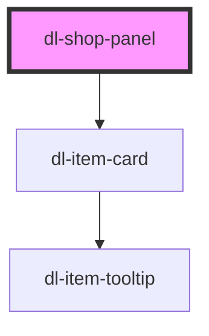

# dl-shop-panel

<!-- Auto Generated Below -->

## Properties

| Property           | Attribute            | Description                                                                      | Type                                                                                                                                                                                                                                                                                | Default     |
| ------------------ | -------------------- | -------------------------------------------------------------------------------- | ----------------------------------------------------------------------------------------------------------------------------------------------------------------------------------------------------------------------------------------------------------------------------------- | ----------- |
| `activeTab`        | `active-tab`         | The tab to display initially. One of `"weapon"`, `"vitality"`, or `"spirit"`.    | `"spirit" \| "vitality" \| "weapon"`                                                                                                                                                                                                                                                | `'weapon'`  |
| `disableHighlight` | `disable-highlight`  | When `true`, disables the highlight effect that dims unrelated items on hover.   | `boolean`                                                                                                                                                                                                                                                                           | `false`     |
| `hoverEffect`      | `hover-effect`       | Hover effect applied to each item card. One of `"none"` or `"scale"`.            | `"none" \| "scale"`                                                                                                                                                                                                                                                                 | `'scale'`   |
| `itemNameLanguage` | `item-name-language` | Override language for item names only. Tooltip content uses the global language. | `Language.CS \| Language.DE \| Language.EN \| Language.ES \| Language.ES_LA \| Language.FR \| Language.ID \| Language.IT \| Language.JA \| Language.KO \| Language.PL \| Language.PT_BR \| Language.RU \| Language.TH \| Language.TR \| Language.UK \| Language.ZH_CN \| undefined` | `undefined` |

## Dependencies

### Depends on

- [dl-item-card](../dl-item-card)

### Graph

----------------------------------------------

*Built with [StencilJS](https://stenciljs.com/)*
